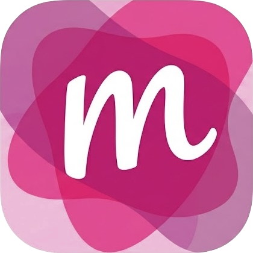

<p align="center">
  
</p>

<h1 align="center">Magent</h1>

<p align="center">
  A native macOS app for managing coding agents as parallel work sessions.<br>
  Each thread is a git worktree with embedded terminals, agent tabs, and full lifecycle management.
</p>

## 📦 Installation

### Homebrew

```bash
brew tap vapor-pawelw/magent
brew install --cask magent
```

To update: `brew upgrade magent`

### GitHub Releases

Download the latest `.zip` from [Releases](https://github.com/vapor-pawelw/magent/releases), unzip, and move `Magent.app` to `/Applications`.

Since the app is unsigned, strip the quarantine attribute before launching:

```bash
xattr -cr /Applications/Magent.app
```

## ✨ Features

### 🧵 Thread Management

Every thread maps 1:1 to a git worktree. Create a thread, get a fresh branch and workspace instantly.

- **Auto-naming** — random names (e.g. `swift-falcon`) that auto-rename based on the first agent prompt
- **Sections** — color-coded Kanban columns (TODO, In Progress, Reviewing, Done) with per-project overrides
- **Archive & delete** — archive removes the worktree but keeps the branch; delete removes both
- **Pinning** — pin important threads to the top
- **Status indicators** — busy, waiting for input, unread completions, uncommitted changes — all at a glance
- **Delivery tracking** — see when all commits have been cherry-picked to the base branch

### 🤖 Multi-Agent Support

Run Claude Code, Codex, or any custom command as your coding agent.

- **Claude Code** — `--dangerously-skip-permissions` mode and `/resume` for session restoration
- **Codex** — standard, `--yolo`, and `--full-auto` modes
- **Custom agents** — any CLI tool works
- **Per-project defaults** — different agents for different repos
- **Auto-trust** — trust settings auto-configured for new worktrees
- **Context transfer** — hand off context between agent tabs via `.magent-context.md`

### 🖥️ Terminal

GPU-accelerated embedded terminal powered by libghostty, with tmux for session persistence.

- **Ghostty rendering** — native GPU-accelerated terminal via libghostty
- **tmux multiplexing** — sessions survive app restarts and support remote SSH attachment
- **Multiple tabs** — agent tabs, terminal tabs, or mixed per thread
- **Tab management** — rename, reorder, pin, close
- **Bell detection** — agent completion detection via BEL character monitoring

### 🔀 Git Integration

Deep git awareness without getting in the way.

- **Worktree lifecycle** — create, rename, archive, delete with automatic branch management
- **Branch tracking** — branch names, dirty state, merge status at a glance
- **PR/MR links** — open pull requests from the toolbar (GitHub, GitLab, Bitbucket)
- **Diff stats** — per-file additions/deletions with staged/unstaged/untracked breakdown
- **Worktree recovery** — missing worktrees are auto-recreated from the branch

### 🎫 Jira Integration

Link threads to Jira tickets for project tracking.

- **Ticket association** — attach a Jira ticket key to any thread
- **Assignment tracking** — visual indicator when a ticket becomes unassigned
- **Sidebar display** — ticket keys shown alongside thread names

### ⚡ CLI Automation

Full programmatic control via `magent-cli` over a Unix domain socket. Manage threads, tabs, and sections from scripts or other agents.

```bash
magent-cli create-thread --project myapp --agent claude --prompt "Add auth"
magent-cli thread-info --thread swift-falcon
magent-cli send-prompt --thread swift-falcon --prompt "Now add tests"
magent-cli move-thread --thread swift-falcon --section "In Progress"
magent-cli archive-thread --thread swift-falcon
```

See the full command reference in [docs/cli.md](docs/cli.md).

### 🔔 Notifications

- **Dock badge** — count of threads with unread completions or waiting for input
- **System notifications** — native macOS notifications for agent events
- **Completion sounds** — configurable sound on agent completion
- **In-app banners** — slide-down status messages with action buttons

## 🛠️ Requirements

- **macOS 14.0+** (Sonoma or later)
- **tmux** — `brew install tmux`
- **git** — included with Xcode Command Line Tools

## 🏗️ Building from Source

See [docs/building.md](docs/building.md) for prerequisites and build instructions.

## 📄 License

[PolyForm Shield 1.0.0](./LICENSE)
