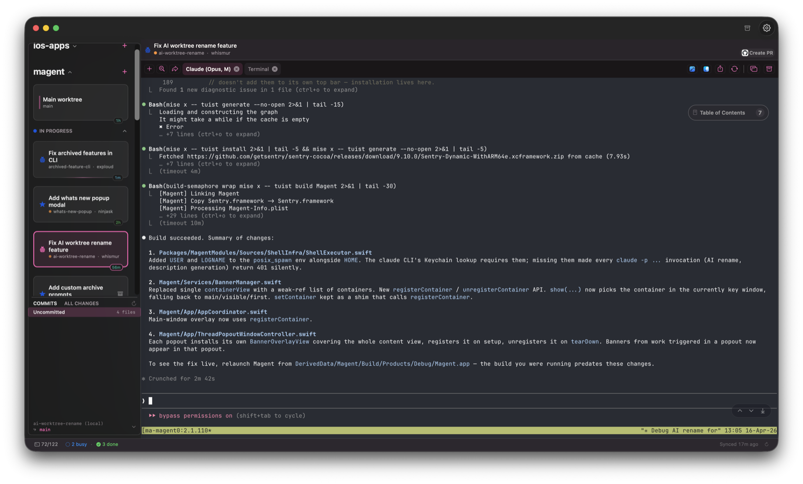
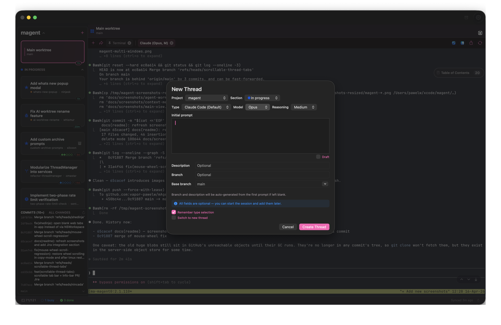
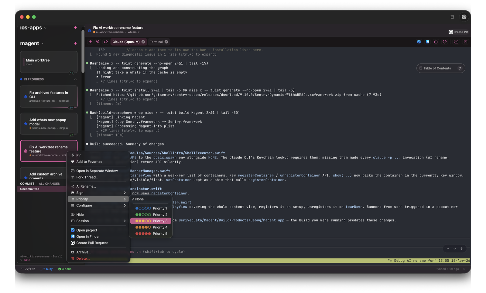
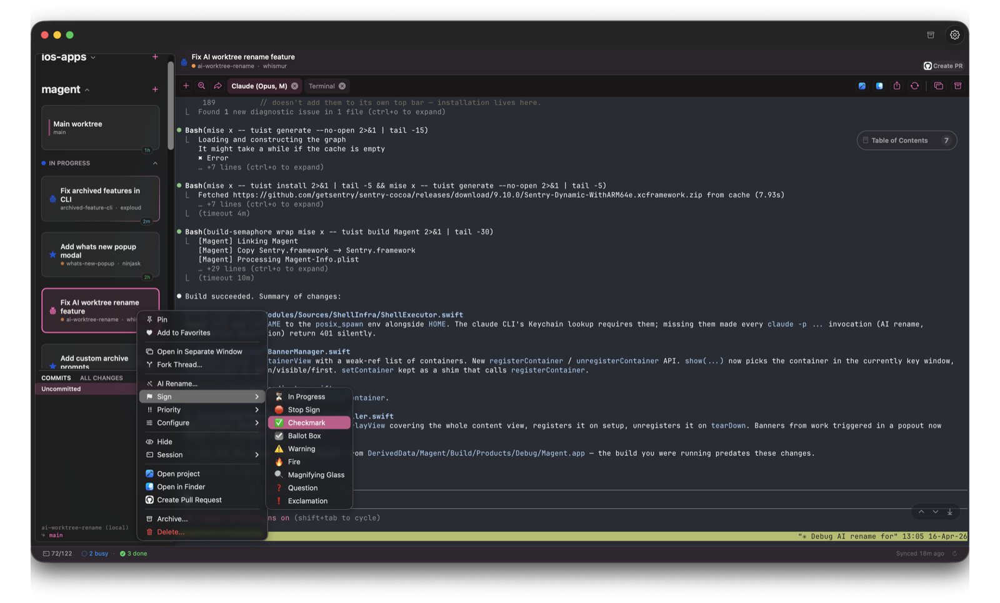
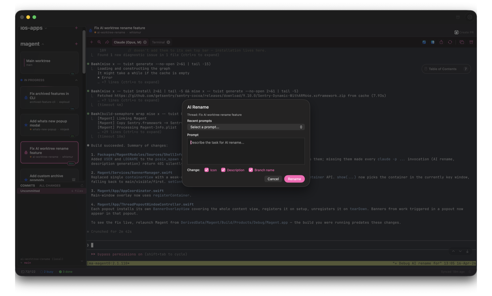
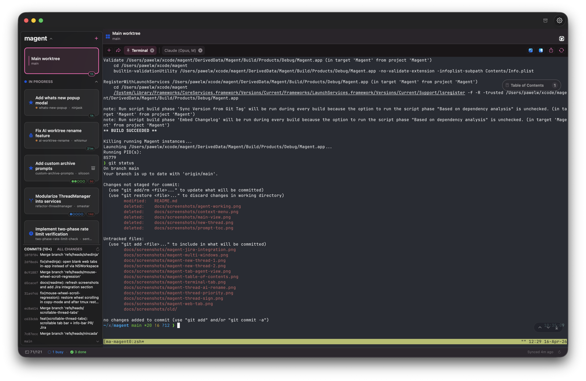
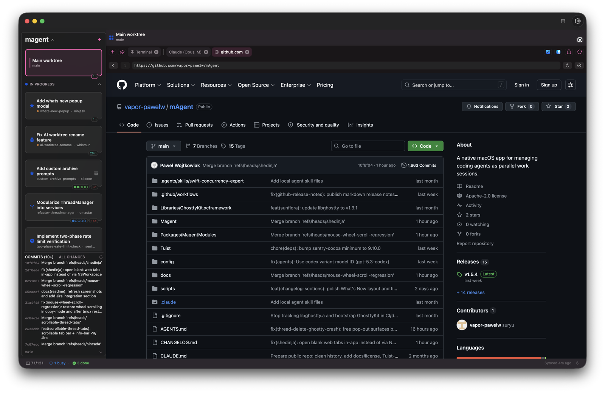
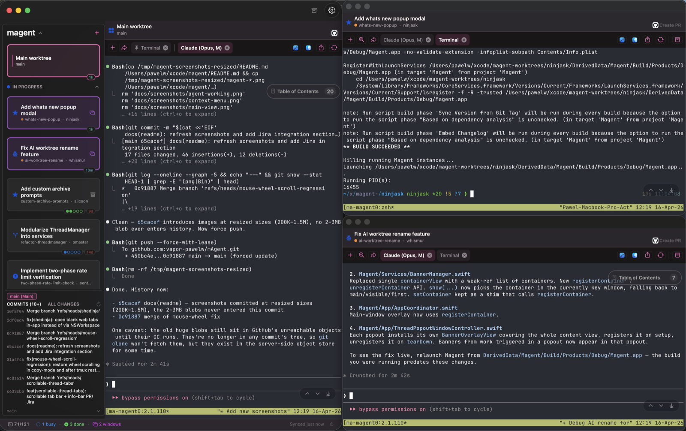
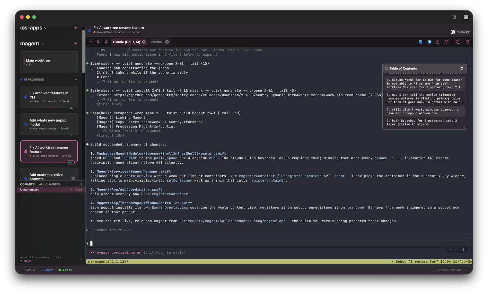
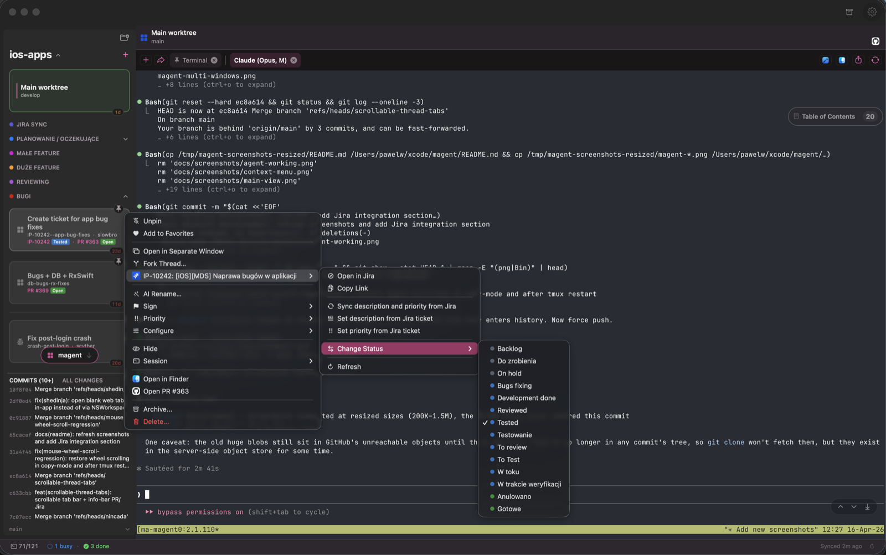

<p align="center">
  
</p>

<h1 align="center">mAgent</h1>

<p align="center">
  Native macOS app for running coding agents in parallel git worktrees.<br>
  Each thread is a worktree + embedded terminal + agent session.
</p>

<p align="center">
  
</p>

## Install

**Homebrew:**
```bash
brew tap vapor-pawelw/tap && brew install --cask magent
```

**Manual:** grab the `.dmg` from [Releases](https://github.com/vapor-pawelw/mAgent/releases).

Requires **macOS 14+**, **tmux** (`brew install tmux`), and **git**.

## Threads & Worktrees

Create a thread and get a git worktree, branch, and agent session instantly. Pick an agent, base branch, and reasoning effort up front — or kick one off with just a prompt. Threads auto-name themselves and rename the branch based on your first prompt.

<p align="center">
  
</p>

Organize with color-coded Kanban sections (TODO, In Progress, Reviewing, Done), drag-to-reorder, pinning, and priority levels. The sidebar shows live status at a glance: busy, waiting for input, rate-limited, unread completions, and uncommitted changes.

<p align="center">
  
</p>

Auto-assigned work type icons classify threads from their first prompt (bug, feature, refactor, docs, etc.), with manual override.

<p align="center">
  
</p>

Branches can be renamed by AI from the current conversation, keeping the worktree name stable while giving the branch a meaningful title.

<p align="center">
  
</p>

## Multi-Agent Terminal

GPU-accelerated embedded terminal (libghostty) with tmux for session persistence. Run Claude Code, Codex, or any custom CLI as your agent, with per-project defaults.

Each thread supports multiple tabs — agent, terminal, web, and draft — that can be pinned, reordered, and renamed. Agent completion is detected automatically with configurable sounds and system notifications.

<p align="center">
  
</p>

Web tabs open in-app for PR reviews, CI dashboards, or docs without leaving the thread.

<p align="center">
  
</p>

Pop tabs out into standalone windows to run several agents side-by-side.

<p align="center">
  
</p>

A searchable Table of Contents indexes every prompt in the conversation so you can jump back to earlier turns instantly.

<p align="center">
  
</p>

## Git & PR Integration

Branch stacking with base branch selection and automatic retargeting when parent branches rename. PR detection and creation for GitHub, GitLab, and Bitbucket with review status badges. Bidirectional file sync between worktrees with merge tool support.

One-click code review tabs, delivery tracking (cherry-pick detection), diff stats, and automatic worktree recovery.

## Jira Integration

First-class Jira support: look up tickets from the thread, open them in-app, and create threads directly from a Jira issue with the ticket key pre-filled in the branch and commit prefix. Thread rows surface ticket status inline, so you can track work without leaving mAgent.

<p align="center">
  
</p>

## Smart Session Management

Idle sessions are automatically evicted to keep resource usage low, with configurable limits and Keep Alive protection for important threads. Rate limits are detected from terminal output with countdown timers and sound alerts when limits lift.

A persistent status bar shows active sessions, rate limit state, and thread counts.

## CLI Automation

Full programmatic control via `magent-cli` over a Unix domain socket.

```bash
magent-cli create-thread --project myapp --agent claude --prompt "Add auth"
magent-cli send-prompt --thread omanyte --prompt "Now add tests"
magent-cli move-thread --thread omanyte --section "In Progress"
magent-cli batch-create --file threads.json
magent-cli archive-thread --thread omanyte
```

See [docs/cli.md](docs/cli.md) for the full command reference.

## Building from Source

See [docs/building.md](docs/building.md).

## License

[Apache License 2.0](./LICENSE)
